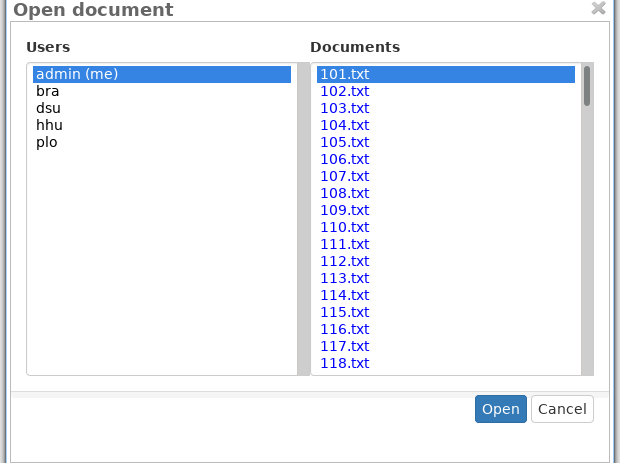
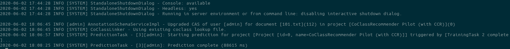
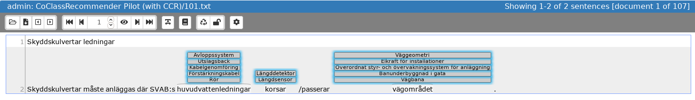

 
[%20(master))](https://zoidberg.ukp.informatik.tu-darmstadt.de:443/jenkins/view/INCEpTION/job/INCEpTION%20(GitHub)%20(master)/)

# INCEpTION

INCEpTION provides a semantic annotation platform offering intelligent annotation assistance and knowledge management.

For more information, visit the [INCEpTION website](https://inception-project.github.io/).

## CoClass Linking

The [CoClass Linking module](https://github.com/munterkalmsteiner/inception/tree/CoClassRecommender/inception-coclass-linking) provides a recommender to associate nouns occurring in natural language text to objects in INCEpTION knowledge bases. In its current implementation, it supports only knowledge bases derived from [CoClass](https://coclass.byggtjanst.se/about#about-coclass) and text in Swedish language.

### Installation
To run the recommender, it is easiest to use the pre-compiled version available at [Zenodo](http://doi.org/10.5281/zenodo.3827169).

Download and unpack `instrumentation.tar.gz`. Then, in folder `instrumentation`, do: 

1. execute `./run.sh` in the folder `SECOS`. This starts the decompounder service used by our recommender. 
2. execute `./run.sh` in the folder `inception`. This starts the INCEpTION server.
3. point your browser to `http://localhost:18080/inception-app-webapp/`. 
4. login with username `admin` and password `ccr2020`. 

For general instruction on how to use INCEpTION, please refer to the [project documentation](https://inception-project.github.io/documentation/).

To see an example of the suggestions produced by our recommender, follow these steps:

1. Open the project `CoClassRecommender Pilot (with CCR)`: 
        
    
2. Click on `Annotation`:
    
    
3. Open the first document:
    
    
4. Now wait until the recommender has done its initialization (this is currently not cached and can take up to 3 minutes). Check out the console output of INCEpTION to see when the initial recommendations are ready:
    
    
5. Press `F5` to reload the page (unfortunately, new recommendations do not trigger an automatic page reload yet)
6. You should see now the produced recommendations:
    
    
7. Accept/reject a recommendation by clicking/double clicking on it.
8. Open another requirement:
    
    

### Software requirements
We have compiled INCEpTION with the following java version:

	openjdk version "11.0.6" 2020-01-14
	OpenJDK Runtime Environment (build 11.0.6+10)
	OpenJDK 64-Bit Server VM (build 11.0.6+10, mixed mode)

For best compatibility, we suggest to use a similar version when running INCEpTION.
 
### Reuse
Guidelines for adapting and reusing the code are provided in the [developer](inception-coclass-linking/src/main/resources/META-INF/asciidoc/developer-guide/coclass-linking.adoc) and [administration](inception-coclass-linking/src/main/resources/META-INF/asciidoc/admin-guide/settings_coclass-linking.adoc) guide.

### References
The pilot experiment in which we used the CoClass Linking module has been described in the following paper:

    @inproceedings{unterkalmsteiner_early_2020,
	    address = {Zurich, Switzerland},
	    title = {Early {Requirements} {Traceability} with {Domain}-{Specific} {Taxonomies} - {A} {Pilot} {Experiment}},
	    booktitle = {28th {IEEE} {International} {Requirements} {Engineering} {Conference}},
	    publisher = {IEEE},
	    author = {Unterkalmsteiner, Michael},
	    month = sep,
	    year = {2020}
    }

