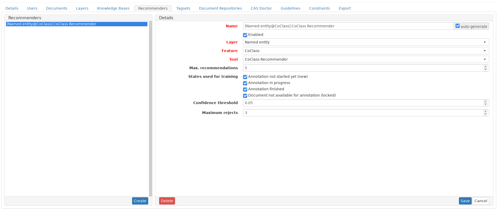

// Copyright 2020
// Software Engineering Research Lab
// Blekinge Institute of Technology
// 
// Licensed under the Apache License, Version 2.0 (the "License");
// you may not use this file except in compliance with the License.
// You may obtain a copy of the License at
// 
// http://www.apache.org/licenses/LICENSE-2.0
// 
// Unless required by applicable law or agreed to in writing, software
// distributed under the License is distributed on an "AS IS" BASIS,
// WITHOUT WARRANTIES OR CONDITIONS OF ANY KIND, either express or implied.
// See the License for the specific language governing permissions and
// limitations under the License.
[[sect_settings_coclass-linking]]

= CoClass Linking

== Prerequisites 
The recommender relies on the existence of a knowledge base to construct a concept lookup table. Hence, before configuring the recommender, a knowledge base needs to be imported (see <<Knowledge Bases>>) and the named entity layer needs to be configured to use the concepts as features in the project settings. The following screenshots shows the typically used settings.

== Configuring the recommender
The recommender needs to be configured in the project settings as shown in the screenshot below.
The currently configurable options are:

* Confidence threshold: recommendations with a lower score are discarded and not shown
* Maximum rejects: recommendations that were rejected _n_ times are not shown anymore

Once the recommender has been saved and is enabled, it will be used in the annotation task.

